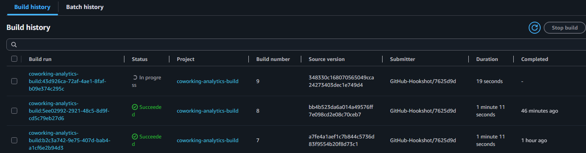
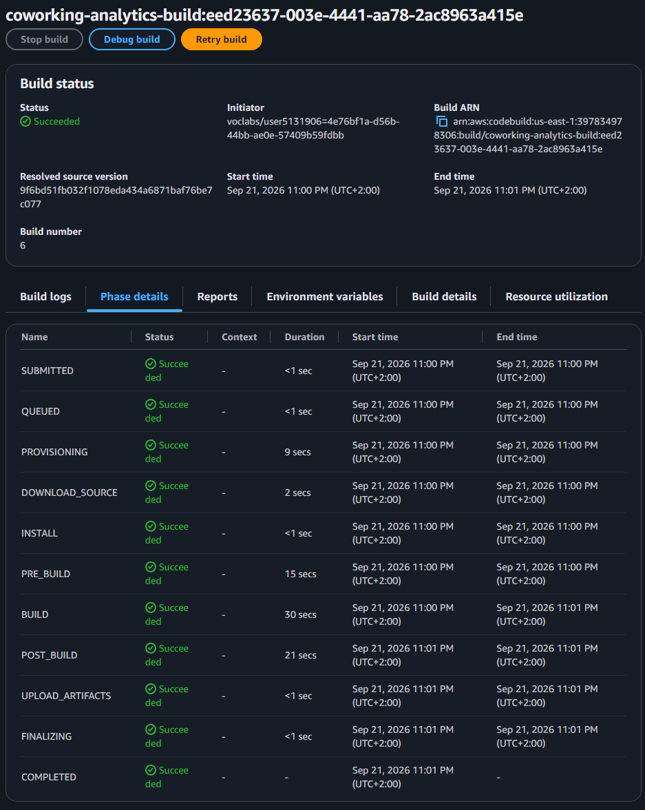
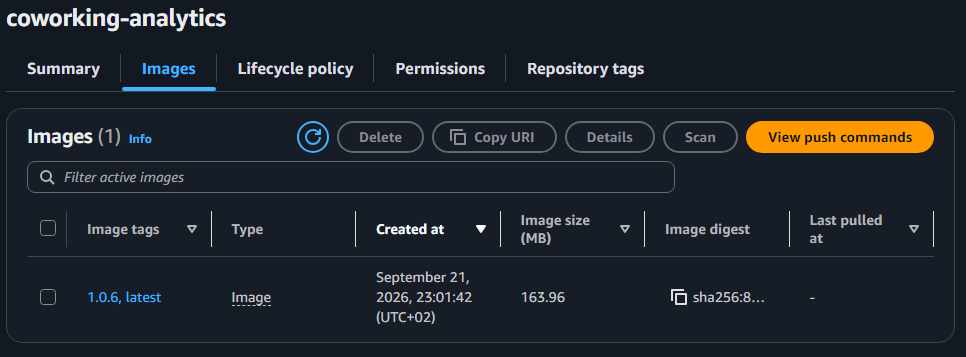
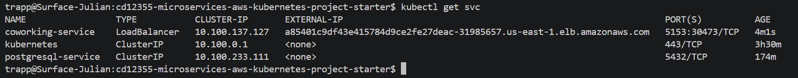
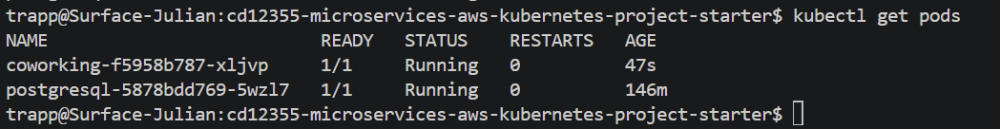
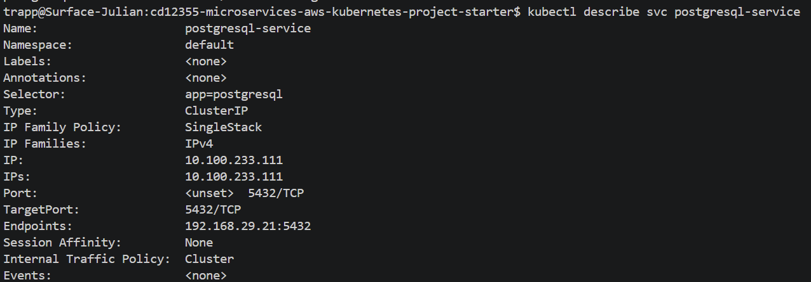
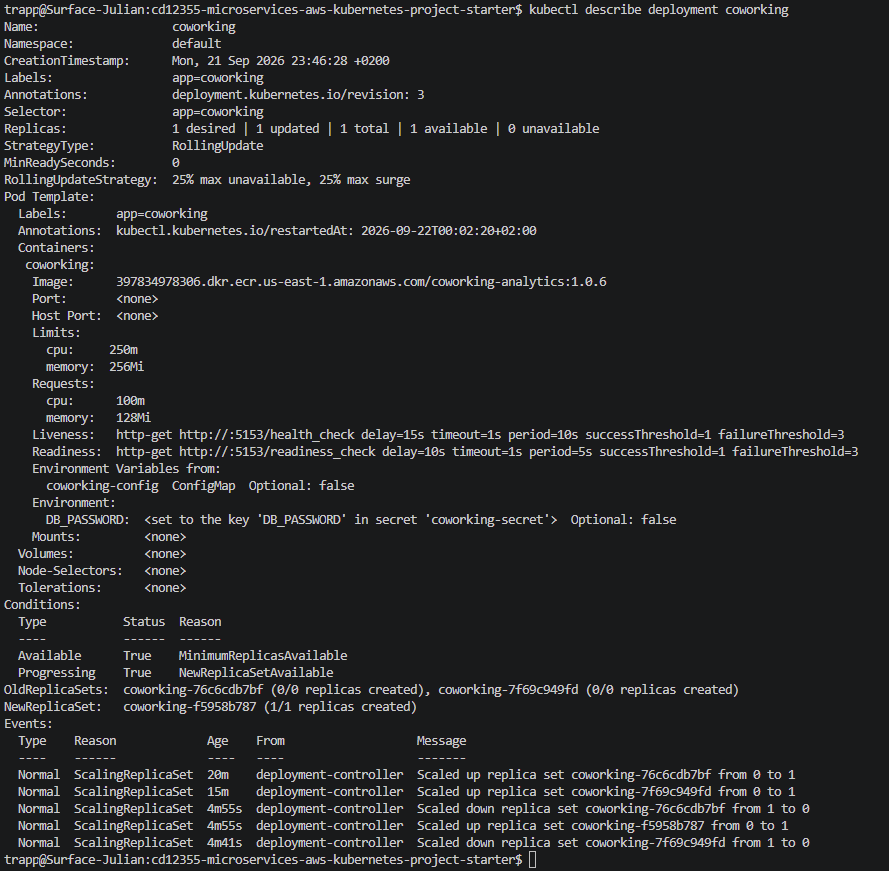
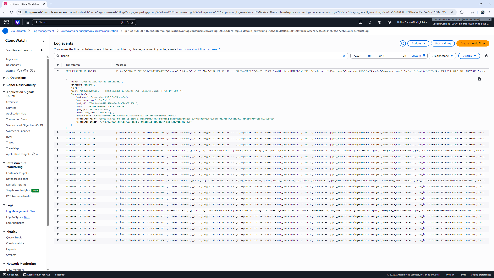

# Coworking Analytics Service Deployment

## Deployment Pipeline & Process
Whenever code hits the `main` branch, a GitHub webhook kicks off AWS CodeBuild automatically. CodeBuild builds the Docker image, tags it with the build ID and `latest`, and pushes it to Amazon ECR. Kubernetes detects the new image and rolls out updated pods via rolling updates with zero downtime.

## Project Deliverables

### 1. Dockerfile
Located at `analytics/Dockerfile`.

A **t3.medium** instance is the ideal choice for this workload. The application handles intermittent analytics queries rather than constant heavy compute, so the burstable baseline performance saves costs while handling occasional traffic peaks. With 2 vCPUs and 4 GB RAM, it easily accommodates system overhead

### 2. AWS CodeBuild Pipeline
Automated webhook trigger from Git commit and successful build execution:



### 3. AWS ECR Repository
Built Docker image pushed with build tags and `latest`:


### 4. Kubernetes Services (`kubectl get svc`)
PostgreSQL running as internal `ClusterIP` and Coworking analytics service exposed via external `LoadBalancer`:


### 5. Kubernetes Pods (`kubectl get pods`)
Both PostgreSQL and Coworking pods running in `1/1 Running` state:


### 6. Database Service Details (`kubectl describe svc postgresql-service`)
Internal cluster IP, endpoints, and target port 5432 configuration:


Python analytics API is lightweight, so **minimum limits** requests of **100m** CPU and **128Mi** memory keeps the base node footprint minimal during idle times. **Max limits** are capped at **250m** CPU and **256Mi** memory to provide headroom for traffic spikes.

### 7. Deployment Configuration (`kubectl describe deployment coworking`)
Resource allocations showing CPU/memory requests and limits:


### 8. Kubernetes Manifests
All declarative configuration files are structured in the `deployment/` directory:
* `postgresql-deployment.yaml`: Runs the PostgreSQL database engine with persistent storage volume claims.
* `postgresql-service.yaml`: ClusterIP service exposing the DB on port 5432
* `configmap.yaml`: Injects non-sensitive environment variables (`DB_HOST`, `DB_PORT`, `DB_NAME`, `DB_USERNAME`)
* `secret.yaml`: Securely manages base64-encoded credentials (`DB_PASSWORD`)
* `coworking-deployment.yaml`: Application pods with defined CPU/memory limits, readiness/liveness probes, and the ECR image reference
* `coworking-service.yaml`: Public load balancer routing inbound traffic on port 5153

### 9. AWS CloudWatch Application Logs
Container log events streaming into CloudWatch:


---

## Database Seeding
Connect to the local port-forwarded database and seed the required initial datasets:

```bash
export DB_PASSWORD=mypassword

for file in $(ls -1v db/*.sql); do
  echo "==> Seeding: $file"
  PGPASSWORD="$DB_PASSWORD" psql --host 127.0.0.1 -U myuser -d mydatabase -p 5433 < "$file"
done